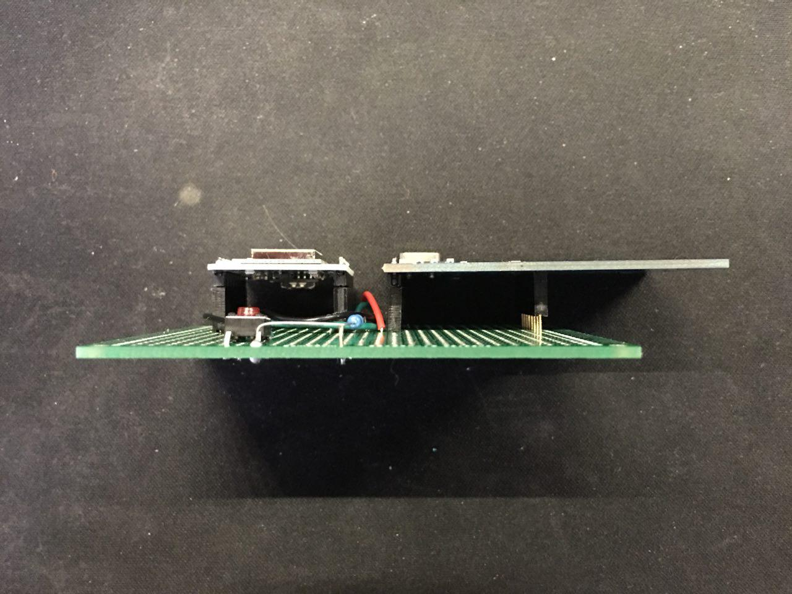

# 教室签退装置

## 硬件制作

由于有高速总线，**所有模块之间需要焊接。尽量避免杜邦线或者面包板连接。**

### 需要的部件

 * [WEMOS D1 Mini](https://wiki.wemos.cc/products:d1:d1_mini)
 * RFID-RC522 模块 Breakout board
 * 常开按钮开关

### 连接

| GPIO 软件编号 | WEMOS D1 Mini | MFRC522  | 按钮开关               |
| --------- | ------------- | -------- | ------------------ |
| 15        | D8            | SDA 或 SS | -                  |
| 14        | D5            | SCK      | -                  |
| 13        | D7            | MOSI     | -                  |
| 12        | D6            | MISO     | -                  |
| -         | -             | IRQ      | -                  |
| -         | GND           | GND      | A 端                |
| 0         | D3            | RST      | -                  |
| -         | 3V3           | 3.3V     | 串联 220Ω 电阻后连接到 B 端 |
| 5         | D1            | -        | B 端                |

点阵板连接示意图

## 软件

  1. 在 Arduino IDE 中添加 Additional Boards Manager URL: `http://arduino.esp8266.com/stable/package_esp8266com_index.json`，然后下载 ESP8266（版本 2.3.0）
  2. 在 Library 菜单加载随附的 MFRC522 库
  3. 选择 WeMos D1 mini 板子和对应的 COM 口
  4. 编译程序并上传

